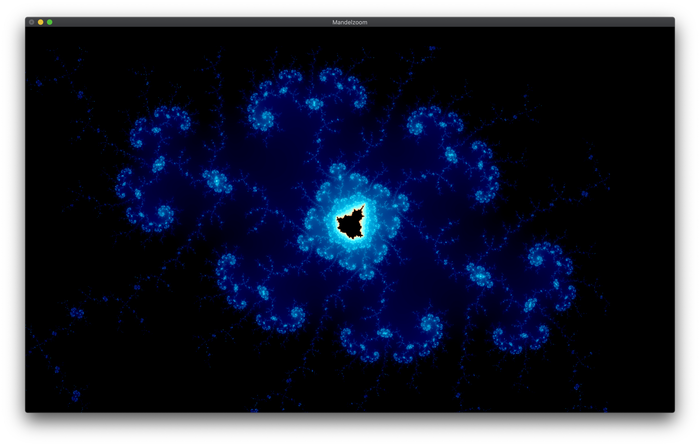

# Project: Mandelzoom
A Mandelbrot set viewer.




## Features
- Use rubber band to zoom into a particular region.
- Undo/redo previous zooms.
- Randomize colors by simply pressing a key.
- Resize the window to get a wider view.

## Organization of the code
The program consists of 8 files:

- `mandelzoom.h` contains settings that you can tweak to change the program's behavior (see the section on *Building*). It also contains declaration of constants and functions used in `mandelzoom.cpp`.

- `mandelzoom.cpp` contains functions that does the drawing and interact with GLUT and OpenGL.

- `Point.h` and `Point.tpp` together contain utilities for manipulating complex numbers/pixels, and computing iterations of the function `f(z) = z^2 + c`.

- `Window.h` and `Window.cpp` together contain definition of the internal representation of windows. I used a base point `(base.x, base.y)` with a scaling `ratio`, which has unit `1 pixel / 1 unit in real` to define the current window in relation to the rectangle in the real plane. This representation is different from the one suggested by the handout. The two files also contain helper functions that manipulate `Window` objects.

- `Color.hpp` and `Color.cpp` together contain utilities for mapping a real number in the range `[0,1]` to a RGB triple. Non-linearity is the key, and I used several trig functions in the mapping. The two files also contain deprecated code initially designed to traverse the `[0,1]^3` space (intuitively this is the set of all possible RGB triples) in some reasonable manner. (I wanted the program to automatically try all possible parameters, but it turned out that the distribution of the inverse Cantor pairing function wasn't exactly what I was hoping for.)


## Building
Start an empty C++ Console Program project in Microsoft Visual Studio or in Xcode. Add all `.h`, `.tpp` and `cpp` files in this directory to the project.

The settings can be adjusted in the `Settings` section of the `mandelzoom.h` file. Here's a (partial) list of changes you can make to the program:

- Enable the `CONSOLE_VER` macro to build a program that accepts console input `(x0, x1, y0, y1, w, h)`.
- Disable `CONSOLE_VER` and enable `EXTRA_CREDIT_VER` to see my submission for the extra credit img.
- Disable both `CONSOLE_VER` and `EXTRA_CREDIT_VER` to view the complete Mandelbrot set (by default). In this case, you may want to change `IMG_COMPLETE` in the line
  ```
   #define INITIAL_WINDOW_PARAMS IMG_COMPLETE
  ```
  to one of the predefined images, including the standard images listed in the assignment handout. See the *Predefined Images* section in the same header file.

- Enable one of `OS_WINDOWS`, `OS_MACOS`, and `OS_LINUX` depending on your OS.
- Control whether the menu is triggered by the middle/right button by enabling `GLUT_MIDDLE_BUTTON` or `GLUT_RIGHT_BUTTON` macro.
- Set the default values for window width & height by changing `DEFAULT_W` and `DEFAULT_H`

## Interacting with the program
When the program is first run, you will see a window displaying (possibly a portion of) the Mandelbrot set.
You can interact with the program in the following ways:
- To zoom into a region of your interest, you can
  - Use a mouse to drag out a rectangle. This region will be enlarged to fill the current display window. During dragging, you can press <kbd>esc</kbd> to cancel the current selection.
  - Press the middle mouse button to trigger the program menu (or the right, depending on the setting). In it you should see a "Zoom In" button.
  - Press key <kbd>i</kbd> on the keyboard.

- To zoom out to a previous region, you can
  - Select "Zoom In" in the menu.
  - Press key <kbd>o</kbd> on the keyboard.

- Note that zooming-in and -out would work even if you have not performed any zooming yet. The default scaling factor is `2x` for zooming in, and `0.5x` for zooming out.

- You can randomize the color by pressing the <kbd>space</kbd> key. To revert to the default color setting, press <kbd>c</kbd>.

- You can freely resize the window, e.g. to get a wider view of the image, as you normally would.

- The image is redrawn whenever the window is restored from the minimized state.

- To exit the program, select "Exit" in the menu, or press <kbd>esc</kbd>.

## To-do's (in order of decreasing priority)

- Make `Point` a superclass of `Complex` and `Pixel`. 
  - Overload the operators.
  - Make all methods `Window`, `Complex`  and `Pixel` return by value instead of by pointer.

- Better formula so that the set appears good regardless of each zoom level.
  - Somehow relate intensity to zoom levels? That is, there is some relation between the distribution of intensity and the zoom levels, e.g. at shallower levels, most points are of low intensity (they hardly escape). But there is always subjective effect on zooming: we select the more interesting parts, i.e. the ones with less all-black or all-white points and more gradual gradient, to zoom in. This suggests that re-calibrating the intensity should be local to each zoom level, not altering the global function which maps intensity to a color. For instance, assuming that we start with the darkest image (the distribution of points is heavily skewed toward low intensity, we can multiply the intensity by some factor (linear? non-linear?) so the sub-region appears more normal (intuition tells me that we should dim the zoomed-in region, but experimentally I obtain higher values for the color parameters in deeper zooms; Of course I do not fully understand how the color parameters are used by the color mapping function that I stumbled across.)

- Make a Makefile that different operating systems (Windows, macOS and Linux).
  
- (Need testing) Redesign reshape strategy to preserve the center. (Or fully fix reshaping -- only render what is absolutely need to be re-rendered.)
  - Might be trivial: just rescale with a factor of 1.0.

- Experiment with the idea of whether it is efficient to save every picture drawn, and to keep a copy of the previous drawn ones to enable faster zooming out.


- Better zooming animations: fading out the entire image, or gently fading out the advancing edge.

- Implement rubber-banding using layers. Can we access the pixels in a particular layer (same layer, different layer?) We can certainly do xor, and other simple logic operations.

- Speed things up.
  - Remove expensive operations:
    - √ Less multiplication, sqrt, etc.
    - Less dependency to enable for loop unrolling.
    - Use faster approximation formula for sine (?)
  - Cross-OS multi-threading in color mapping.

- Automatic zooming into a selected point.
  - Would need better precision (infinite precision?) floating point arithmetic.
  
- √ Fix drawing rubber band, which sometimes disappear (seems to non-deterministic). (*Update*: I forgot to set rubber band drawing color to white every time.)

- √ Fix probable memory leaks.

- √ Fix redo/undo to support further zooming-in/out even when the stack of operations is empty.

- √ Separate out the code that maps intensity values to RGB triples into a standalone `Color` class.
  - Linearize distribution of intensity (I), defined as the ratio between the number of trials before the sequence diverge and the cap.
  - Better mapping from I to RGB triples ([0,1] -> [0.1]^3).
    - Currently using sine with period of `1 + alpha`, where `alpha` is a parameter.
  - Design some animation to traverse different combinations of RGB triples, ~~possibly via the inverse Cantor pairing function generalized to Z^3.~~ (*Update:* implemented the inverse of Cantor pairing in 3D, but found out that it was not a good way to traverse the triples. The elements at the front vary substantially more than later elements. Intuition is that when the function produces a pair, the first element has exclusive access to the first of the pair, but the tail elements must share the second of the pair. Thus distribution is not smooth when transitioning from one triple to the next.)
  - A larger zoo of non-linear functions and ways of combining them.
    - Stumbled upon the intermediate function `tan(1/log(intensity+1))/PI*3` which works reasonably when piped into the function `sin(I*2PI * (k/2 +1))`.